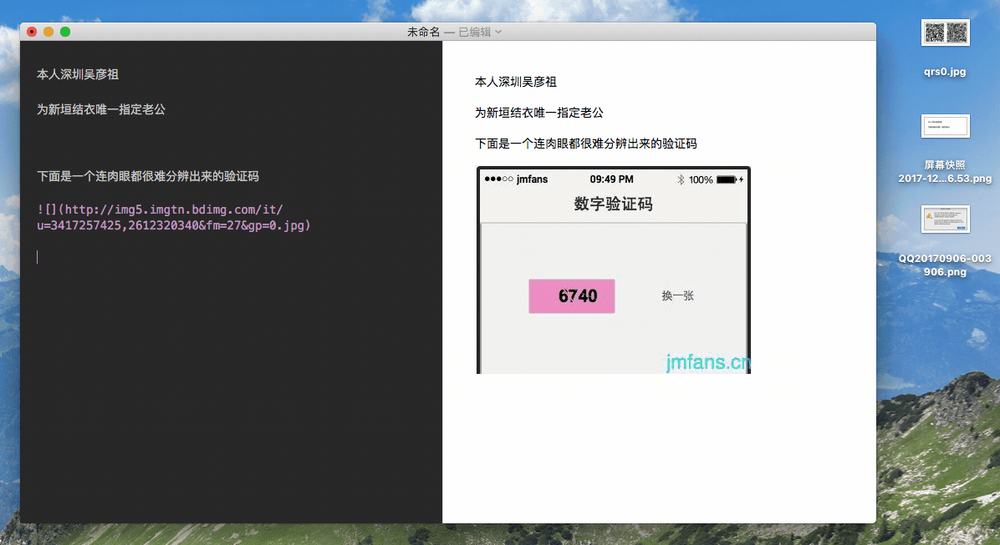
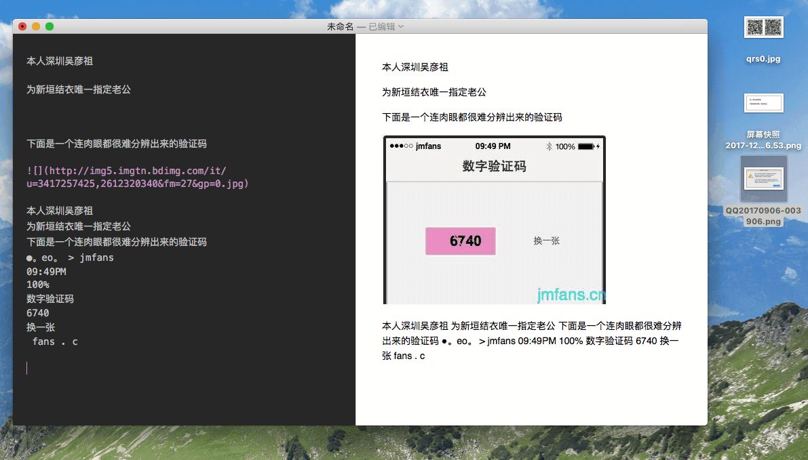
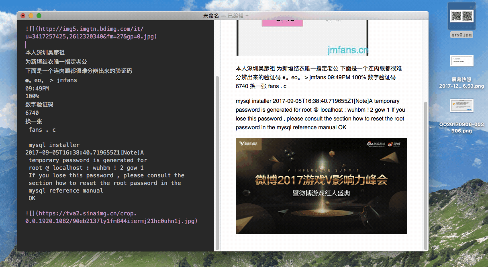
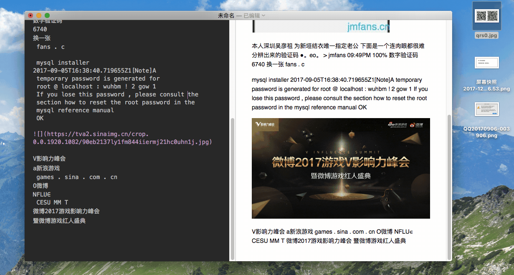
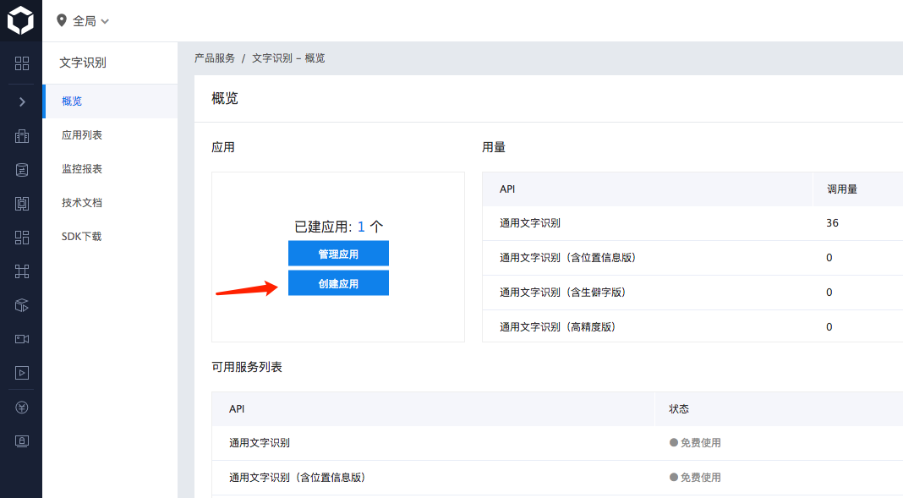
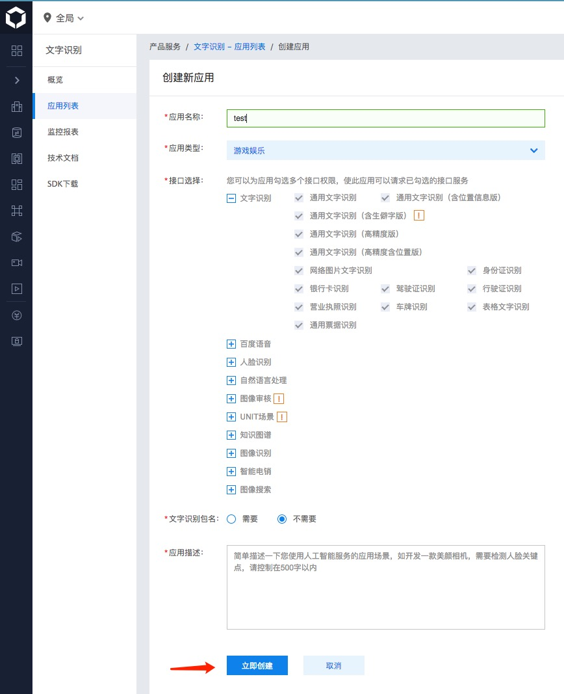
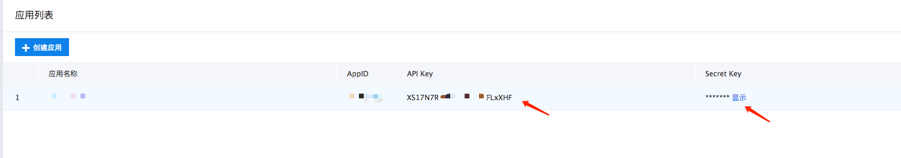
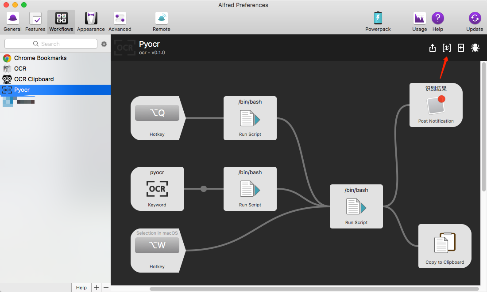
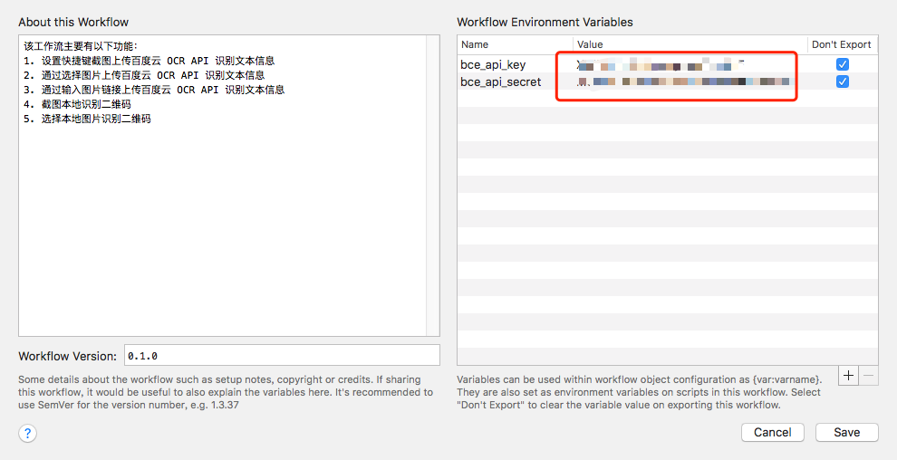
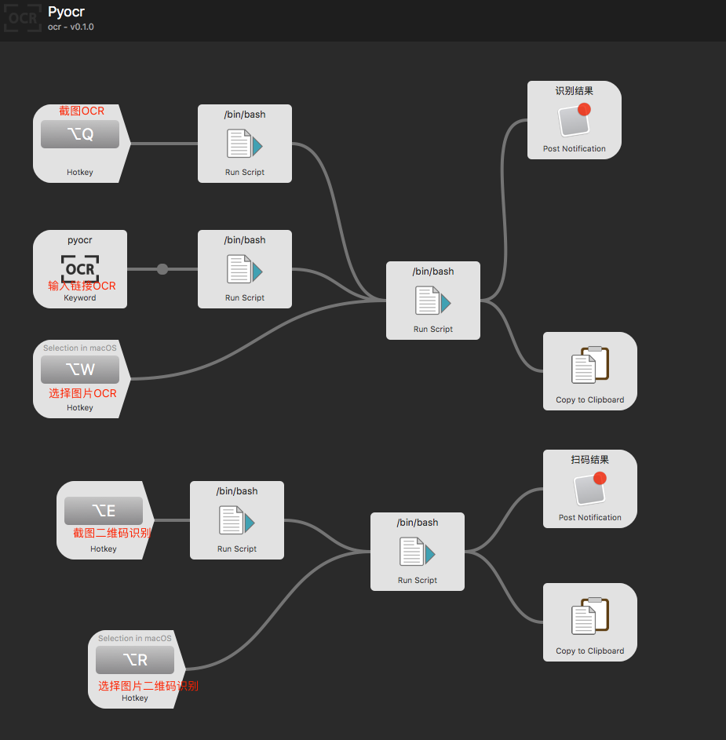

# Pyocr-Alfredworkflow

OCR Alfredworkflow Python 版。

本工作流主要包含以下功能：

1. 设置快捷键截图上传百度云 OCR API 识别文本信息

2. 通过选择图片上传百度云 OCR API 识别文本信息

3. 通过输入图片链接上传百度云 OCR API 识别文本信息

4. 截图本地识别二维码
5. 选择本地图片识别二维码

## OCR使用方法

1. [下载](https://github.com/AcerFeng/Pyocr-Alfredworkflow/releases) 并用 Alfred 安装
2. 在 [百度云控制台](https://console.bce.baidu.com/ai/#/ai/ocr/overview/index) 申请一个文字识别应用，记下 API Key 和 API Secret

3. 将 API Key 和 API Secret填入环境变量

## 二维码扫描

二维码扫描需确保已安装以下库

1. pillow
2. zbar
3. zbarlight

安装 pillow 库

	sudo pip install pillow
	
安装 zbar 

	brew install zbar
	
安装 zbarlight

	sudo pip install zbarlight
	
全部安装成功后即可正常使用。

## 快键键设置（可自定义）

## 感谢

gragrance  [CaptuocrToy](https://github.com/gragrance/CaptuocrToy)

oott123  [Alfred Clipboard OCR](https://github.com/oott123/alfred-clipboard-ocr/)

jadec0der [Alfred-OCR](https://github.com/jadec0der/alfred-ocr)

[iconfont](http://iconfont.cn/collections) 提供图标

## 授权协议

[GNU General Public License v3.0](https://github.com/AcerFeng/Pyocr-Alfredworkflow/blob/master/LICENSE)